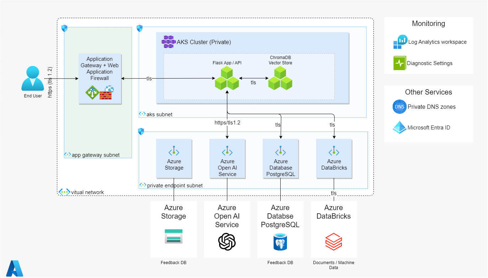

# Open AI Chatbot Architecture

This reference architecture shows a chatbot architecture that uses generative AI workloadsto provide a conversational interface to users.

## Architecture

## Components

- [Application Gateway](https://azure.microsoft.com/products/application-gateway/) is a layer 7 (HTTP/S) load balancer and web traffic manager. It uses URL path-based routing to distribute incoming traffic across availability zones and offloads encryption to improve application performance.
- [Azure Database for PostgreSQL](https://learn.microsoft.com/en-us/azure/postgresql/) is a fully managed relational database service based on the open-source Postgres database engine.
- [Azure Databricks](https://azure.microsoft.com/services/databricks) is a data analytics platform. Its fully managed Spark clusters process large streams of data from multiple sources.
- [Azure DNS](https://azure.microsoft.com/services/dns) is a hosting service for DNS domains that provides name resolution using Microsoft Azure infrastructure. Private DNS zones provide a way to map a service's fully qualified domain name (FQDN) to a private endpoint's IP address.
- [Azure Kubernetes Service (AKS)](https://learn.microsoft.com/en-us/azure/aks/) is a managed Kubernetes service that simplifies deploying, managing, and scaling containerized applications using Kubernetes.
- [Azure Monitor](https://azure.microsoft.com/products/monitor/) is a monitoring service that collects, analyzes, and acts on telemetry data across your deployment.
- [Azure OpenAI](https://learn.microsoft.com/en-us/azure/ai-services/openai/) is a fully managed service that provides REST API access to Azure OpenAI's language models, including the GPT-4, GPT-3.5-Turbo, and embeddings set of models.
- [Azure virtual network](https://azure.microsoft.com/products/virtual-network/) is a service that enables you to create isolated and secure private virtual networks in Azure. For a web application on App Service, you need a virtual network subnet to use private endpoints for network-secure communication between resources.
- [Blob Storage](https://learn.microsoft.com/en-us/azure/storage/blobs/) Azure Blob Storage is Microsoft's object storage solution for the cloud. Blob storage is optimized for storing massive amounts of unstructured data.
- [Managed Identity](https://learn.microsoft.com/en-us/azure/ai-services/openai/how-to/managed-identity) Managed identities for Azure resources can authorize access to Azure AI services resources using Microsoft Entra credentials from applications running in Azure virtual machines (VMs), function apps, virtual machine scale sets, and other services.
- [Microsoft Entra ID](https://azure.microsoft.com/products/active-directory/) is a cloud-based identity and access management service. It provides a single identity control plane to manage permissions and roles for users accessing your web application. It integrates with App Service and simplifies authentication and authorization for web apps.
- [Private Link](https://azure.microsoft.com/products/private-link/) makes it possible for clients to access Azure platform as a service (PaaS) services directly from private virtual networks without using public IP addressing.
- [Web Application Firewall (WAF)](https://azure.microsoft.com/products/web-application-firewall/) is a cloud-native service that protects web apps from common exploits such as SQL injection and cross-site scripting. WAF provides visibility into the traffic to and from your web application, enabling you to monitor and secure your application.

## Authentication

- End users authenticate to the flask app with Microsoft Entra ID OAuth and an registered [Application Registration](https://learn.microsoft.com/en-us/azure/active-directory/develop/quickstart-register-app) in Azure Active Directory.
- The flask app uses a [Managed Identity](https://learn.microsoft.com/en-us/entra/identity/managed-identities-azure-resources/overview) to authenticate with Azure OpenAI.
- The flask app connects to Databricks with [OAuth machine-to-machine authentication](https://learn.microsoft.com/en-us/azure/databricks/dev-tools/python-sql-connector#--oauth-machine-to-machine-m2m-authentication) using an Azure Databricks service principal.

# Considerations

- Databricks SQL Connector for Python versions 2.7.0 and above support [OAuth user-to-machine (U2M) authentication](https://learn.microsoft.com/en-us/azure/databricks/dev-tools/auth/oauth-u2m).

# References

- End to End chat reference architecture https://learn.microsoft.com/en-us/azure/architecture/ai-ml/architecture/baseline-openai-e2e-chat
- See https://learn.microsoft.com/en-us/azure/architecture/ai-ml/architecture/azure-openai-baseline-landing-zone
- Databricks Auth-Authz https://learn.microsoft.com/en-us/azure/databricks/security/auth-authz/
