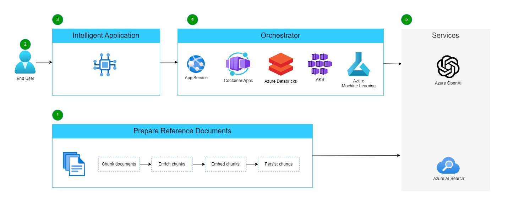
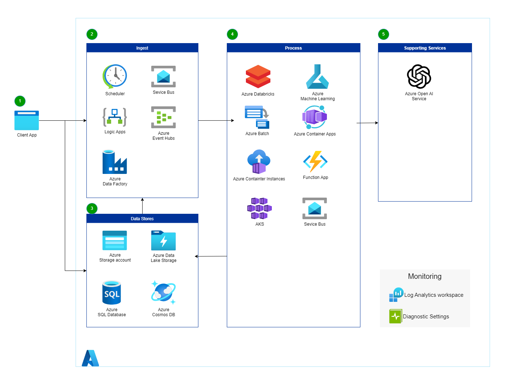

# Intelligent App

The following is a high-level flow for the PDF file evaluation solution.

1. Prepare reference documents for the solution.
   - Documents are either pushed or pulled into the data pipeline.
   - Chunk document - break document into semantically meaningful sections.
   - Enrich chunnks - add metadata fields from the content like keywords, category, summary, etc.
   - Embed chunks - use an embedding model to vectorize the chunk and metadata fields for vector searches.
   - Persist chunks - store chunks in a search index.
2. The user submits a document for evaluation.
3. The intelligent application makes a call to an orchestrator.
4. The orchestrator calls the appropriate service to process the document.

   - The orchestrator determines what search to perform on Azure AI Search andissues the query.
   - The orchestrator packages the top N results from the query as context within a prompt and sends it to the large language model.

## Architecture Components

1. Client App integration submits data for evaluation.
   - Either directly to an endpoint or
   - Upload to storage account
2. Trigger Processing pipeline options
   - Timer
   - Queue
   - ...
3. Data Sources
   - Target for Client upload. Uploading files to storage can trigger the pipeline
   - Transitional and permanent storage
   - Location for Reports
4. Data Processing Pipeline Compute
   - Some processing may need different compute types (GPU vs CPU, High/Low memory)
   - Orchstration options vary between options
5. Other Dependencies Services

# References

- Re-engineer mainframe batch apps https://learn.microsoft.com/en-us/azure/architecture/example-scenario/mainframe/reengineer-mainframe-batch-apps-azure
- Choose an Azure Compute service https://learn.microsoft.com/en-us/azure/architecture/guide/technology-choices/compute-decision-tree
- Azure Container Apps https://learn.microsoft.com/en-us/azure/container-apps/overview
- High-volume batch transaction processing https://learn.microsoft.com/en-us/azure/architecture/example-scenario/mainframe/process-batch-transactions
- Ingest ETL Stream with ADX https://learn.microsoft.com/en-us/azure/architecture/solution-ideas/articles/ingest-etl-stream-with-adb
- RAG Solution Design and Evaluation Guide https://learn.microsoft.com/en-us/azure/architecture/ai-ml/guide/rag/rag-solution-design-and-evaluation-guide
