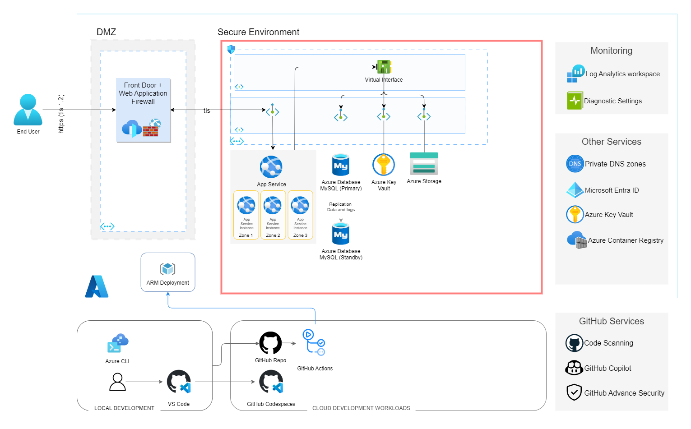
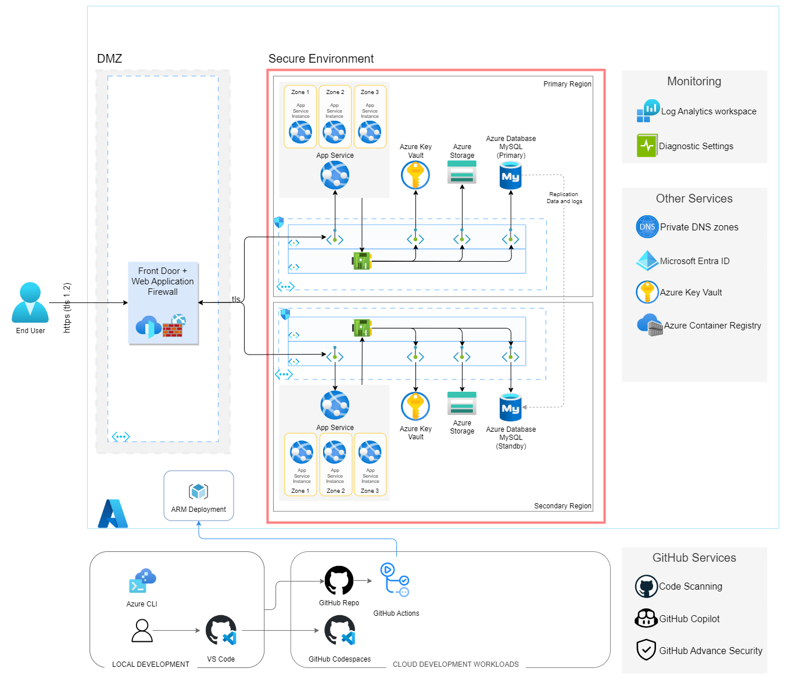

# Wordpress Architecture

## Zonal Redundant Architecture

## Region Redundant Architecture

# References
* WordPress on Azure https://learn.microsoft.com/en-us/azure/architecture/example-scenario/infrastructure/wordpress-app-service
* AppService HA Deployment https://learn.microsoft.com/en-us/azure/architecture/web-apps/app-service-environment/architectures/ase-high-availability-deployment
* Baseline Zone Reduendancy Architecture https://learn.microsoft.com/en-us/azure/architecture/web-apps/app-service/architectures/baseline-zone-redundant
* Enterprise App Pattern https://learn.microsoft.com/en-us/azure/architecture/web-apps/guides/enterprise-app-patterns/modern-web-app/dotnet/guidance
* Multi-region app https://learn.microsoft.com/en-us/azure/app-service/tutorial-multi-region-app
* App Service Reliability https://learn.microsoft.com/en-us/azure/reliability/reliability-app-service?tabs=cli
